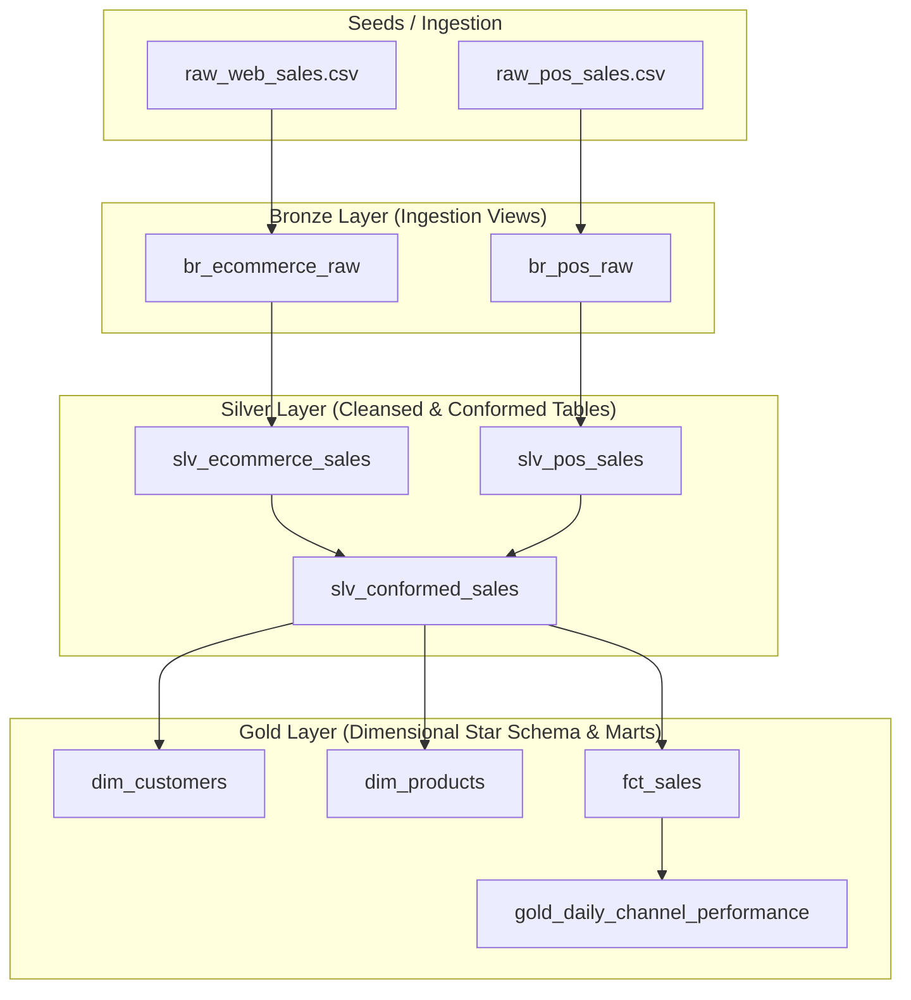

# Omnichannel E-Commerce & Retail POS Data Platform (dbt + PostgreSQL + Docker)

[](https://getdbt.com)
[](https://www.postgresql.org/)
[](https://www.docker.com/)
[](.github/workflows/dbt_ci.yml)
[](https://python.org)

An enterprise-grade ELT data pipeline built with **dbt Core**, **PostgreSQL**, and **Docker**. It ingests and transforms omnichannel transactional data across online web stores and physical in-store checkout registers (POS) using the **Medallion Architecture (Bronze ➔ Silver ➔ Gold)** and a **Kimball Star Schema**.

---

## 🏗️ Architecture & Data Lineage (DAG)



---

## 🌟 Medallion Layer Implementation

### 1. 🥉 Bronze Layer (`models/bronze/`)
* **Materialization**: `view`
* **Purpose**: Exact 1:1 view over raw source data seeds.
* **Metadata**: Injects `_loaded_at` ingestion timestamps without altering original source formats.
* **Models**: `br_ecommerce_raw`, `br_pos_raw`.

### 2. 🥈 Silver Layer (`models/silver/`)
* **Materialization**: `table`
* **Purpose**: Data quality enforcement, deduplication, cleansing, and schema conformity across channels.
* **Cleansing Logic**:
  * **Deduplication**: Eliminates duplicate orders/receipts using `row_number() over (partition by order_id ...)`.
  * **Anomaly Filters**: Removes negative quantities, negative/zero prices, future timestamps, and corrupt country codes (`UNKNOWN`, `XX`).
  * **Missing Values**: Imputes missing guest customers (`CUST-GUEST`) and anonymous in-store shoppers (`WALK-IN`).
  * **Standardization**: Maps divergent channel columns into an enterprise omnichannel format (`slv_conformed_sales`).

### 3. 🥇 Gold Layer (`models/gold/`)
* **Materialization**: `table`
* **Purpose**: Business-ready dimensional models (Star Schema) and pre-aggregated analytical marts.
* **Models**:
  * **`fct_sales`**: Central transaction fact table with surrogate MD5 hash key (`sales_key`), foreign keys, and additive metrics.
  * **`dim_customers`**: Customer dimension containing lifetime spend, order count, preferred sales channel, and RFM tiers (`VIP`, `Repeat`, `One-Time`, `Anonymous`).
  * **`dim_products`**: Product catalog dimension with unit price distributions and gross revenue totals.
  * **`gold_daily_channel_performance`**: Executive daily reporting mart tracking orders, revenue, active customers, and Average Order Value (AOV) by channel and country.

---

## 🧪 Data Quality & Automated Testing

This project enforces strict data contracts with **39 automated tests** running on every build:

* **Primary Key Uniqueness & Non-Null**: Verified on all tables (`order_id`, `sales_key`, `customer_id`, `product_id`).
* **Referential Integrity (`relationships`)**: Validates that 100% of `product_id` records in `fct_sales` exist in `dim_products`.
* **Allowed Values (`accepted_values`)**: Restricts `sales_channel` strictly to `['WEB', 'POS']` and customer tiers to defined business categories.
* **Custom Singular Assertion (`assert_positive_total_amount.sql`)**: Ensures zero transactions exist with a non-positive total sale amount.

---

## 🚀 Quickstart Guide

### Prerequisites
* [Docker Desktop](https://www.docker.com/products/docker-desktop/) (running)
* Git

### 1. Clone & Setup Environment
```bash
git clone https://github.com/<your-username>/e_comm-dbt-postgres.git
cd e_comm-dbt-postgres

# Copy environment configuration
cp .env.example .env
```

### 2. Start PostgreSQL Container
```bash
docker compose up -d postgres
```

### 3. Build Entire Pipeline with dbt (Seeds, Models & Tests)
```bash
docker compose run --rm dbt build
```

---

## 📖 Interactive Documentation & Data Lineage

Generate and view the dbt data catalog and lineage graph in your browser:

```bash
# 1. Generate the catalog
docker compose run --rm dbt docs generate

# 2. Start the documentation web server
docker compose run -p 8080:8080 --rm dbt docs serve --port 8080
```
Open **`http://localhost:8080`** in your browser to inspect column definitions, SQL source code, and interactive DAG graphs.

---

## 💼 Resume Bullet Points

You can include this project on your resume with the following descriptions:

* *Designed and deployed an end-to-end containerized ELT pipeline using **dbt Core**, **PostgreSQL**, and **Docker**, processing multi-channel transactional data (Web E-Commerce + Physical Retail POS).*
* *Implemented a **Medallion Architecture (Bronze ➔ Silver ➔ Gold)** featuring a Kimball Star Schema with fact tables, customer RFM dimensions, and daily executive performance marts.*
* *Engineered automated data cleansing and deduplication layers in SQL, handling anomalies such as missing customer identifiers, corrupt country codes, and non-positive prices.*
* *Established robust data governance with **39 dbt schema & singular data quality tests**, enforcing foreign key referential integrity, domain validation, and CI/CD testing via **GitHub Actions**.*
